# Apache Ignite: The Complete Mastery Guide 🚀

Welcome to the comprehensive training manual for Apache Ignite. This guide is designed for developers of all levels—from freshers to seasoned architects. By the end of this guide, you will not only understand *what* Apache Ignite is but also *how* to build high-performance distributed systems using it.

---

## 1️⃣ Introduction to Apache Ignite

### What is Apache Ignite?
Imagine you have a massive library with millions of books. If you ask the librarian for a specific book, they have to walk through long aisles, find the shelf, and bring it to you. This takes time. This is how a **Traditional Database (RDBMs)** works; it stores data on a hard disk (a slow physical medium).

**Apache Ignite** is like giving that librarian a magical tablet that contains every page of every book in memory. No walking, no searching—just instant access.

> [!IMPORTANT]
> **Standalone Architecture**
> This project has evolved to a **Standalone Architecture**. This means the Ignite server runs as an independent process, and your Spring Boot application connects to it as a **Client Node**. This is the standard pattern for production enterprise systems.

**Official Definition:** Apache Ignite is a distributed database, caching, and processing platform designed to store and compute on massive volumes of data in-memory, at scale.

### Why was it created?
In modern applications (like Amazon, Uber, or Banking systems), we need data **now**. Traditional databases struggle with:
1.  **Latency:** Disk access is 1,000x slower than memory access.
2.  **Scalability:** When millions of users join, a single database server can crash.

Ignite solves this by using **RAM** as the primary storage and **distributing** data across many computers (Nodes).

### Where does Ignite fit?
Ignite is often used as an **IMDB (In-Memory Database)** or an **IMDG (In-Memory Data Grid)** sitting between your application and your database to speed things up.

---

## 2️⃣ Basic Concepts (Beginner Friendly)

### In-Memory Computing
Storing and processing data directly in the RAM instead of the hard drive. 

### Distributed Cache
A cache that isn't just on one computer, but spread across a network of computers (Cluster). If one computer runs out of space, you just add another one!

### Node & Cluster
*   **Node:** A single computer running an Ignite instance.
*   **Cluster:** A group of nodes working together as one giant "supercomputer".

### Server vs Client Node
*   **Server Node:** The "Workers". They store data and do the heavy lifting.
*   **Client Node:** The "Connectors". Your Spring Boot app usually acts as a client node to talk to the server nodes.

### Key-Value Storage
Ignite stores data like a `HashMap`:
*   **Key:** Product ID (101)
*   **Value:** Product Name ("Laptop"), Price ($1000)

### ASCII Diagram: The Ignite Cluster
```text
      [ App ] ----> [ Client Node ]
                        |
      ---------------------------------
      |               |               |
[ Server Node A ] [ Server Node B ] [ Server Node C ]
 (Stores Data)     (Stores Data)     (Stores Data)
```

---

## 3️⃣ Apache Ignite Architecture (Step-by-Step)

### Data Partitioning
Ignite doesn't store all data on every node (that would be a waste of memory). Instead, it breaks data into **Partitions**.
*   Partition 1 goes to Node A.
*   Partition 2 goes to Node B.
*   Ignite uses **Rendezvous Hashing** to decide who gets what. Don't worry about the math—just know it's fair and balanced!

### Backup Copies
What if Node A crashes? You'd lose Partition 1. To prevent this, Ignite creates **Backups**. Node B might hold a copy of Partition 1.

### Self-Healing
If a node goes down, the cluster detects it immediately. It promotes the backup copy to "Primary" status and starts re-distributing data to ensure everyone is safe.

---

## 4️⃣ Cache Types Explained

| Cache Type | What it means | When to use |
| :--- | :--- | :--- |
| **Partitioned** | Data spread across nodes. | Huge data that doesn't fit on one node. |
| **Replicated** | Every node has ALL data. | Small, rarely changed data (e.g., Country Codes). |
| **Local** | Only stays on one node. | Temporary, non-distributed tasks. |

> [!TIP]
> **Partitioned Cache** is the most common for high-scale applications.

---

## 5️⃣ Ignite Persistence

Sometimes, memory isn't enough. If the power goes out, RAM is wiped.
**Native Persistence** allows Ignite to write data to both RAM **and** Disk.

1.  **WAL (Write-Ahead Log):** Every change is first logged to a file (very fast).
2.  **Checkpoints:** Periodically, the log is synced with the main data files.
3.  **Restart:** If the app crashes, Ignite reads the disk files and recovers everything!

---

## 6️⃣ Real Application Design (Core Part)

To learn Ignite, we built a **Product Management System**. 

### Why this app?
1.  **High Traffic:** Products are searched constantly.
2.  **Data Consistency:** When a price changes, every node must know.
3.  **Scalability:** We might have millions of products.

### How Ignite is used?
*   **Source of Truth:** A database (H2 In-Memory).
*   **Performance Layer:** Apache Ignite Cache.
*   **Flow:** When a user asks for a product, we first check **Ignite**. If it's there (Cache Hit), we return it instantly. If not (Cache Miss), we get it from DB and store it in Ignite for next time.

---

## 7️⃣ Project Folder Structure

```text
src/main/java/com/ignite/mastery
 ├── config       // IgniteConfig.java (Brain setup)
 ├── controller   // ProductController.java (API endpoints)
 ├── service      // ProductService.java (Logic & Cache management)
 ├── repository   // ProductRepository.java (DB access)
 ├── model        // Product.java (Data object)
 ├── cache        // CacheNames.java (Constants)
 └── resources    // application.properties (Settings)
```

---

## 8️⃣ Spring Boot + Ignite Integration

How does Ignite start in Spring?
In `IgniteConfig.java`, we define a `@Bean` that returns an `Ignite` instance. 
1.  **DataStorageConfiguration**: Sets RAM limits (e.g., 500MB).
2.  **CacheConfiguration**: Sets how the cache behaves (Mode, Backups).
3.  **Ignition.start()**: This triggers the node to join the cluster.

> [!CAUTION]
> **Dependency Conflict Alert:** 
> Apache Ignite 2.x requires **H2 version 1.4.197**. If you use a newer version (like H2 2.x), you will get a `NoClassDefFoundError: org/h2/value/ValueByte`. We have manually set this version in our `pom.xml`.

---

## 9️⃣ Code Walkthrough

### Model Class (`Product.java`)
Must implement `Serializable`. Why? Because Ignite might need to send this product to another computer over the network.

### Service Logic (`ProductService.java`)
This is the heart of the learning. Look at the `getProduct` method:
```java
// Check Cache first
Product cached = productCache.get(id); 
if (cached != null) return cached; // Fast!

// If not in cache, check DB
Product dbProduct = repository.findById(id).get();
productCache.put(id, dbProduct); // Store in cache for next time!
```

---

## 🔟 Logging Explained

Proper logging is the only way to "see" Ignite working. In our app:
*   `✅ CACHE HIT`: Means data was found in RAM. Super fast!
*   `❌ CACHE MISS`: Means data was NOT in RAM. We had to go to the slow DB.
*   `💾 Data fetched from DB`: Shows the recovery process.

Check your console logs after running the app to see these in action.

---

## 1️⃣1️⃣ Data Flow Diagram

```mermaid
sequenceDiagram
    participant User
    participant Controller
    participant Service
    participant IgniteCache
    participant Database

    User->>Controller: GET /api/products/1
    Controller->>Service: getProduct(1)
    Service->>IgniteCache: get(1)
    
    alt Cache Hit
        IgniteCache-->>Service: Return Product
        Service-->>User: Instant Response ✅
    else Cache Miss
        IgniteCache-->>Service: null
        Service->>Database: findById(1)
        Database-->>Service: Return Product
        Service->>IgniteCache: put(1, product)
        Service-->>User: Response (Slower) 💾
    end
```



---

## 12️⃣ Common Beginner Mistakes

1.  **Ignoring Serialization:** Forgetting to implement `Serializable` in models.
2.  **Using Ignite as a simple Map:** Ignite is distributed. Don't store huge objects that are accessed every millisecond without thinking about network hops.
3.  **Zero Backups:** Running in production with `backups = 0`. If a node dies, data is lost!

---

## 13️⃣ When to Use Ignite?

*   ✅ **Use Ignite when:** You have a massive RDBMS that is slow, or you need to do complex calculations on distributed data.
*   ✅ **Use Redis when:** You just need a simple, super-fast key-value store for smaller sets of data without complex SQL-like queries.
*   ❌ **Don't use Ignite when:** Your data is very small and fits on one machine anyway.

---

## 14️⃣ Summary & Key Takeaways

*   **Ignite is In-Memory First.**
*   **Nodes form a Cluster** to share the load.
*   **Partitions** divide the work; **Backups** ensure safety.
*   **Spring Boot Integration** is just about defining the right configuration bean.

---
**Congratulations!** You now have architect-level understanding of Apache Ignite. Go ahead, run the demo app and see the magic!

## 1️⃣5️⃣ Troubleshooting: Java 17+ Compatibility

If you are using Java 17 or higher, Ignite needs permission to access certain internal Java modules. 

**The Error:** You might see a `ReflectionException` or `IllegalAccessError`.

**The Fix:** We have already added `--add-opens` flags to your `pom.xml`. This tells the Java Virtual Machine (JVM) that Ignite is allowed to optimize its memory management. 

### 2. NoClassDefFoundError: org/h2/value/ValueByte
**The Error:** The app fails to start because of a conflict between Ignite and the H2 database.
**The Cause:** Modern Spring Boot uses H2 2.x, but Ignite 2.x needs H2 1.4.197.
**The Fix:** Force the H2 version in `pom.xml`:
```xml
<dependency>
    <groupId>com.h2database</groupId>
    <artifactId>h2</artifactId>
    <version>1.4.197</version>
</dependency>
```

Normally, you would run it like this if using the command line directly:
```bash
java --add-opens=java.base/jdk.internal.misc=ALL-UNNAMED ... -jar app.jar
```
But in our project, `mvn spring-boot:run` handles this automatically!
