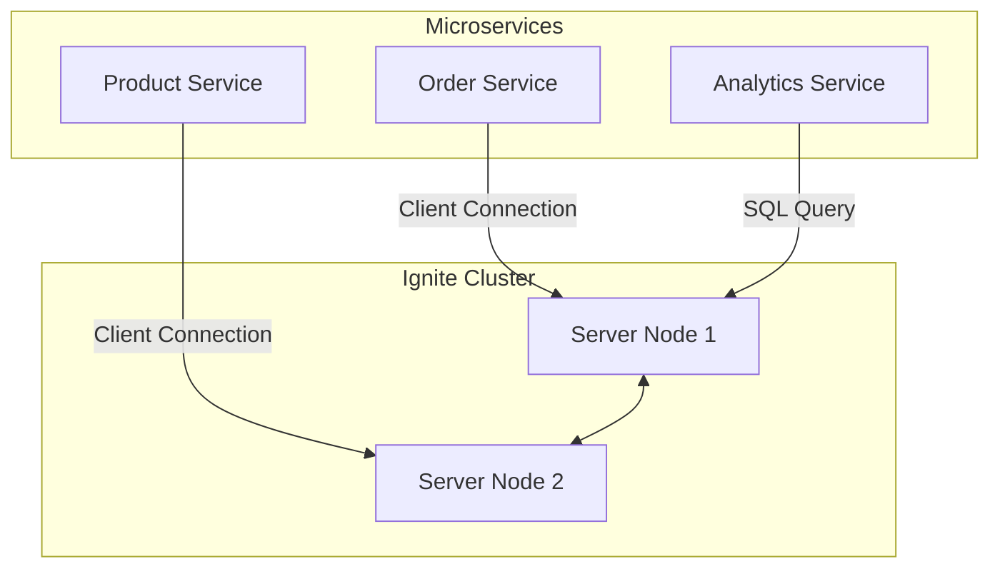

# Apache Ignite: Standalone Architecture Mastery 🏗️

In an enterprise environment, Apache Ignite is rarely "embedded" inside a single application. Instead, it runs as a **Standalone Service** (or a Cluster of services) that multiple microservices connect to.

This guide explains how to design, configure, and connect to a standalone Apache Ignite cluster.

---

## 1️⃣ Standalone vs. Embedded Architecture

| Feature | Embedded Mode | Standalone Mode (Recommended) |
| :--- | :--- | :--- |
| **Lifecycle** | Starts/Stops with your App. | Runs independently as a service. |
| **Resources** | Shares RAM/CPU with your App. | Has its own dedicated RAM/CPU. |
| **Scaling** | Scaling the app scales Ignite. | Scale Ignite nodes independently of Apps. |
| **Usage** | Single App usage. | **Shared across many Microservices.** |

### Standalone Architecture Diagram


---

### 1. Java 17+ Compatibility (ReflectionException)
If you are using Java 17 or higher, Ignite needs permission to access internal Java modules. 

**The Fix:** We have added `--add-opens` flags to your `pom.xml`. 

To start the **Standalone Server** with these flags automatically, use:
```bash
mvn exec:exec@start-ignite-server
```

To start your **Spring Boot Client**, use:
```bash
mvn spring-boot:run
```

### 2. NoClassDefFoundError: org/h2/value/ValueByte
This error typically means that the H2 database driver is missing from your classpath. H2 is often used by Ignite internally for SQL query parsing and other features, even if you're not explicitly using it as your primary data store.

**The Fix:** Add the H2 dependency to your `pom.xml`:
```xml
<dependency>
    <groupId>com.h2database</groupId>
    <artifactId>h2</artifactId>
    <version>1.4.197</version> <!-- Use this version for Ignite 2.x compatibility -->
</dependency>
```

---

## 2️⃣ Core Components of Standalone Ignite

### Server Nodes
These are the "storage" nodes. They hold the data (RAM + Disk) and perform computations. You usually run them via `ignite.sh` or `ignite.bat` using a `.xml` config file.

### Client Nodes (Thick Client)
Your Spring Boot app starts a "Client Node". It doesn't store data but it knows the topology of the cluster. It can perform complex operations like "Entry Processors".

### Thin Clients
A lightweight connection (like a JDBC driver). It doesn't join the cluster topology. Ideal for simple CRUD operations or languages other than Java (Python, .NET, Go).

---

## 3️⃣ Data Regions & Persistence

In production, you don't want to lose data if the server restarts.

### Native Persistence
Ignite can store data on disk. 
*   **WAL (Write Ahead Log):** Fast sequential writes for recovery.
*   **Checkpointing:** Periodically moving data from RAM to the main storage files.

### Data Regions
You can divide your RAM into different "Regions".
*   **Region A:** 10GB for Orders (High priority, persistent).
*   **Region B:** 2GB for Sessions (Low priority, in-memory only).

---

## 4️⃣ SQL Support & Indexing

Ignite is not just a Key-Value store; it's an **SQL Database**.
You can use standard SQL:
```sql
SELECT * FROM Product WHERE price > 500;
```
To enable this, you must define **Indexes** in your configuration. This allows Ignite to find data instantly without scanning every record.

---

## 5️⃣ High Availability (HA)

Standalone Ignite is built for 24/7 uptime.

1.  **Replication:** Set `backups = 1` or more. If one node dies, the other immediately takes over.
2.  **Partition Loss Policy:** Tells Ignite what to do if too many nodes die at once (e.g., stop the cluster to prevent data corruption).
3.  **Automatic Rebalancing:** When a new node joins, Ignite automatically moves data to the new node to balance the load.

---

## 6️⃣ Production Folder Structure

For a production-grade microservice project using Standalone Ignite:

```text
ignite-enterprise-root
 ├── ignite-server-config/
 │    └── ignite-server.xml      // The "Source of Truth" config
 ├── microservice-orders/
 │    ├── src/...
 │    └── application.yml       // Connects to standalone Ignite
 ├── microservice-products/
 │    ├── src/...
 │    └── application.yml       // Connects to standalone Ignite
 └── scripts/
      └── start-ignite.sh       // Startup script for the cluster
```

---

## 7️⃣ Connecting from Spring Boot (Example)

Instead of starting a server, your `IgniteConfig` tells the app to be a **Client**.

```java
@Bean
public Ignite igniteClient() {
    IgniteConfiguration cfg = new IgniteConfiguration();
    
    // CRITICAL: Tells the app NOT to store data
    cfg.setClientMode(true); 

    // Find the standalone server
    TcpDiscoverySpi spi = new TcpDiscoverySpi();
    TcpDiscoveryVmIpFinder ipFinder = new TcpDiscoveryVmIpFinder();
    ipFinder.setAddresses(Arrays.asList("192.168.1.100:47500..47509"));
    spi.setIpFinder(ipFinder);
    cfg.setDiscoverySpi(spi);

    return Ignition.start(cfg);
}
```

---

## 8️⃣ Best Practices

1.  **Dedicated RAM:** Always leave 20-30% of RAM for the OS. If nodes swap to disk, performance dies.
2.  **Network Latency:** Keep your App and Ignite Cluster in the same data center/VPC.
3.  **Thin vs Thick:** Use Thin Clients if your app has limited RAM. Use Client Nodes (Thick) if you need high-performance features like "Data Collocation".
4.  **Monitoring:** Use **Ignite Control Center** or Prometheus/Grafana to watch your RAM usage.

---
**Summary:** Standalone Ignite is the industry standard. It decouples your data from your code, providing a resilient, scalable, and high-performance backbone for your microservices.
